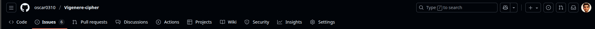
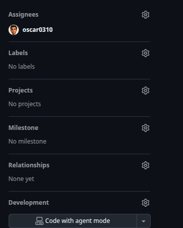
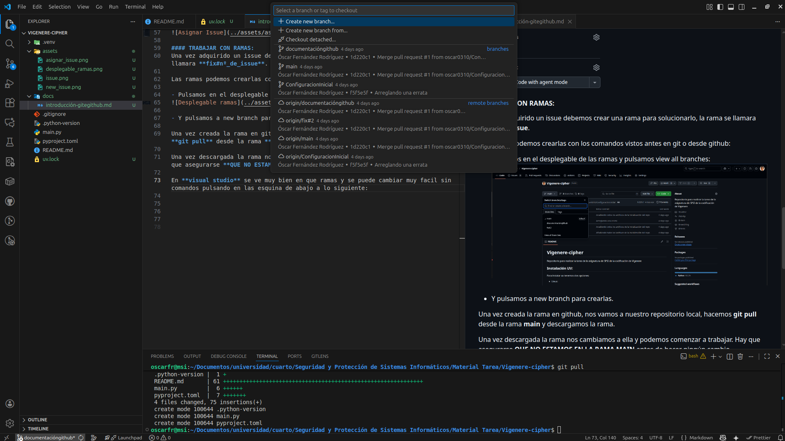
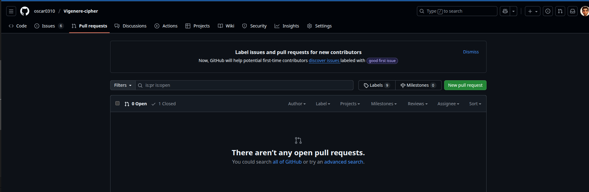

# INTRODUCCIÓN A GIT Y GITHUB:

## REQUISITOS PREVIOS:

- Tener instalado git en el ordenador.[Enlace Instalación.](https://git-scm.com/install/)
- Generar la clave ssh y conectarla con github. [Enlace de como hacerlo.](https://docs.github.com/es/authentication/connecting-to-github-with-ssh/generating-a-new-ssh-key-and-adding-it-to-the-ssh-agent)

## DIFERENCIAS GIT Y GITHUB:
Previo a comentar como se va a trabajar hay que diferenciar entre git y github:

- Github es la plataforma web donde estará alojado nuestro repositorio, allí podremos crear **issues, ramas, pull_request, etc.**, aquí repartiremos el trabajo y comprobaremos que los cambios estan bien.

- Git es el programa local que usaremos para trabajar, y se usará para sincronizar nuestra versión local con el repositorio.

## FORMA DE TRABAJAR :

### COMANDOS BÁSICOS GIT:

#### CLONAR EL REPOSITORIO:
- Clonar el repositorio en local para trabajar con él solo es necesario hacerlo una vez:
> git clone **direccion_http_repositorio**
- En nuestro caso será siempre:
> git clone https://github.com/oscar0310/Vigenere-cipher.git

#### TRABAJAR CON RAMAS:
Las ramas es la forma de trabajar evitando actualizar el repositorio principal donde solo estarán los cambios quye funcionen. **NUNCA TRABAJAR EN LA RAMA MAIN**
- Saber en que rama estas ( devuelve todas las ramas y en la que estas con un asterisco):
> git branch
- Crear una rama:
> git branch nombre_rama  
- cAMBIAR DE RAMA:
>git checkout nombre_rama

#### COMANDOS PARA ACTUALIZAR LOS CAMBIOS QUE HAGAS:
- Actualizar con los cambios subidos en GITHUB:
> git pull
- Añadir los archivos cambiados (nunca usar **git add .**: añade todo hasta archivos generados por el editor):
> git add archivo1 archivo2 ...
- Añadir comentario de porque lo has hecho:
> git commit -m "Titulo de lo que has hecho" -m " Descripción de porque lo has hecho"
- Añadir los cambios al repositorio:
>git push

**Cualquier comando que veais que haga falta se aceptan sugerencias**

### ITERACCIÓN DE TRABAJO:

#### REPARTIR EL TRABAJO:
Lo primero que haremos es repartirnos el trabajo con las issues, son los problemas que tenemos que resolver , se pueden ver en el repositorio de github en:

Dentro de ahí puedes crear los issues si fuera necesario: 

Para asignar un issue, pulsamos en el issue y en assignes lo asignamos:

#### TRABAJAR CON RAMAS:
Una vez adquirido un issue debemos crear una rama para solucionarlo, la rama se llamara **fix#nº_de_issue**.

Las ramas podemos crearlas con los comandos vistos antes en git o desde github:

- Pulsamos en el desplegable de las ramas y pulsamos view all branches:

- Y pulsamos a new branch para crearlas.

Una vez creada la rama en github, nos vamos a nuestro repositorio local, hacemos **git pull** desde la rama **main** y descargamos la rama.

Una vez descargada la rama nos cambiamos a ella y podemos comenzar a trabajar. Hay que asegurarse **QUE NO ESTAMOS EN LA RAMA MAIN** antes de hacer ningún cambio.

En **visual studio** se ve muy bien en que ramas y se puede cambiar muy facil sin comandos pulsando en las esquina de abajo a lo siguiente:

#### SUBIR LOS CAMBIOS A GITHUB

Para tener un control de los cambios es recomendable ir añadiendolos poco a poco, para saber que estas haciendo.

Lo normal es ir haciendo commits con pequeñas tareas y justificando por que lo haces. Una vez hecha esa pequeña tarea, **guardamos lo que hemos hecho en local ctrl+s**:
- Añadimos los documentos que has cambiado:
>git add archivo1 archivo2 ...
- Hacemos el commit del cambio con el siguiente formato ( el nº de issue hace que se añadan los commits ordenados al issue y así puedes comnprobar facil lo que has hecho):
>git commit -m "#nº_de_issue Titulo de lo que has hecho" -m " Descripción de porque lo has hecho"

Estos dos se suelen usar cada vez que hagas un cambio y el archivo que has cambiado **no estaba en el repositorio**.

En caso de que ya estuviera subido el archivo,**guardamos lo que hemos hecho en local ctrl+s**, se pueden añadir con :
>git commit -am "#nº_de_issue Titulo de lo que has hecho" -m " Descripción de porque lo has hecho"

Una vez terminada la sesión de trabajo o para comprobar que subes todo y no te dejas nada:
>git pull #añadimos los cambios al repositorio.

#### FUSIONAR CON LA RAMA MAIN
Una vez ya tenemos subido todo en github y comprobamos que hemos solucionado el issue, llega la hora de fusionarlo, para ello nos vamos a github  a pull_request:

Creamos uno nuevo escogemos como **base: main y compare: nuestra rama.**

